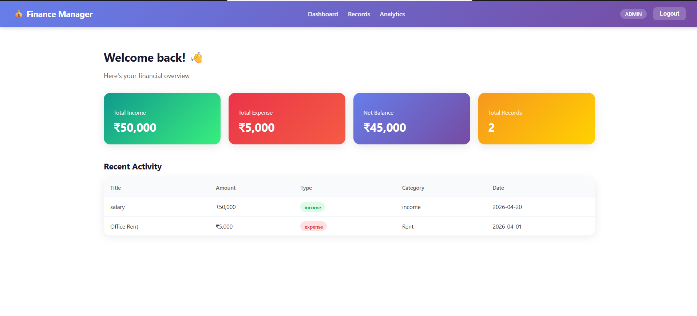
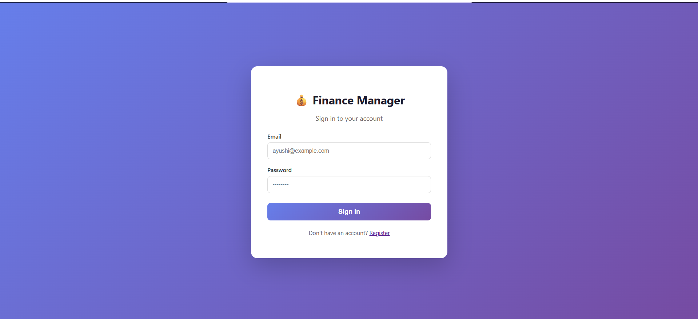
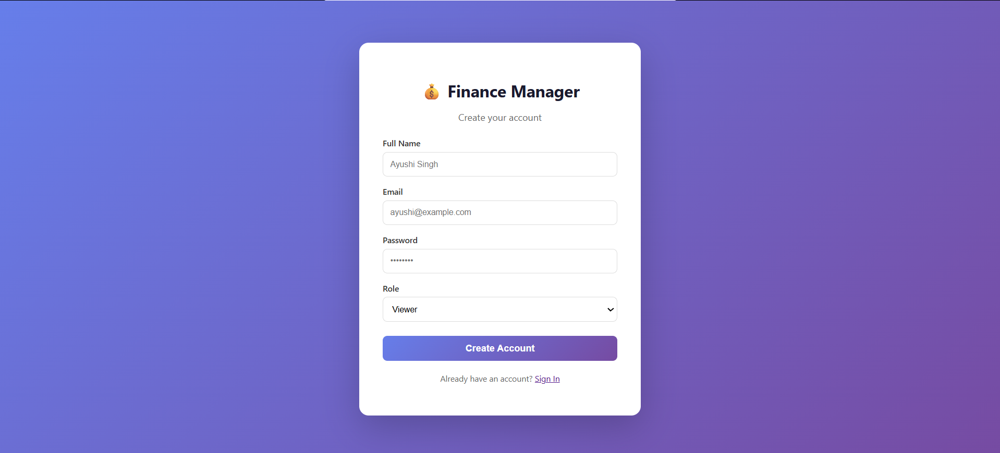
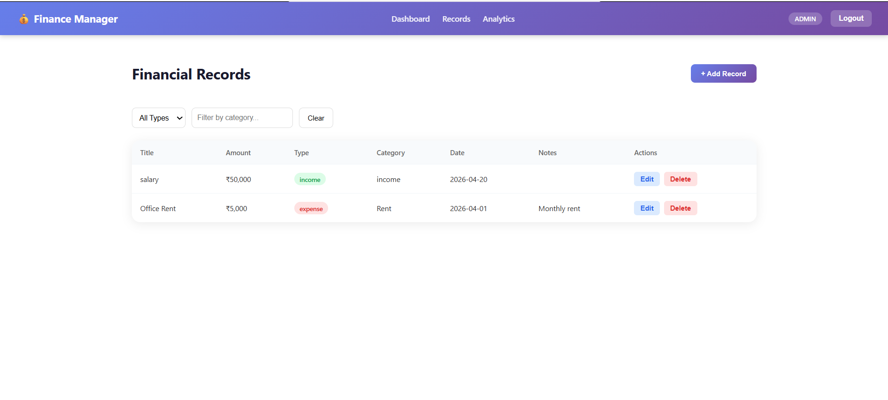
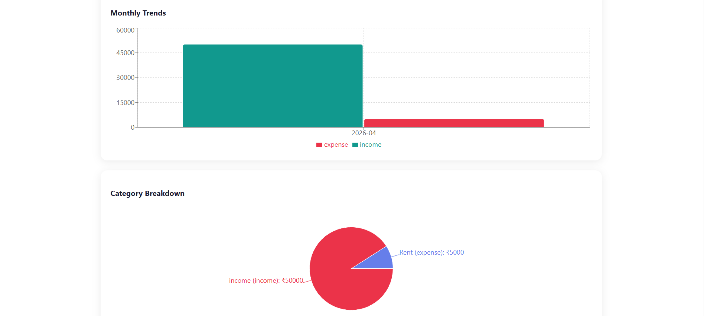
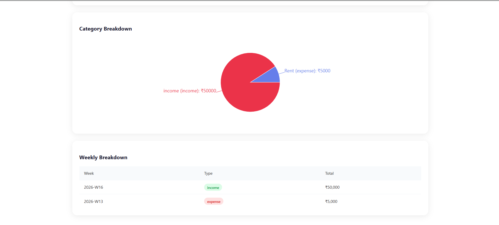

cat > ~/Desktop/finance-app/README.md << 'EOF'
# 💰 Finance Management System

A full-stack finance dashboard application with role-based access control, built with React.js and Node.js.

## 🚀 Live Demo
- **Frontend:** Coming soon (Vercel)
- **Backend API:** https://finance-backend-sfjj.onrender.com

## 🛠️ Tech Stack

### Frontend

### Backend

## 📸 Screenshots

### Login Page

### Register Page

### Dashboard

### Financial Records

### Analytics & Trends

## ✨ Features

- 🔐 **JWT Authentication** — Secure login and registration
- 👥 **Role-Based Access Control** — Viewer, Analyst, Admin roles
- 💼 **Financial Records** — Full CRUD with filtering and pagination
- 📊 **Analytics Dashboard** — Income/expense charts, trends, category breakdown
- 👤 **User Management** — Admin can manage users and roles
- 📱 **Responsive UI** — Clean modern React.js interface

## 👥 User Roles

| Role | Permissions |
|------|-------------|
| Viewer | Read records only |
| Analyst | Read records + view analytics |
| Admin | Full access — create, edit, delete, manage users |

## 🗂️ Project Structure